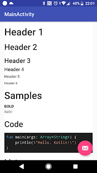
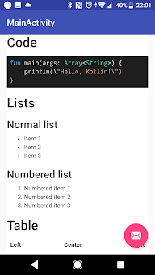

# MarkdownView

This is MarkdownView for Android.

# Screenshots




# Usage
1. Add following to root `build.gradle`
```groovy
allprojects {
	repositories {
		...
		maven { url 'https://jitpack.io' }
	}
}
```

2. Add the dependency to `build.gradle`
```groovy
...
dependencies {
  implementation 'com.github.KosukeTakahashi:markdownview:v1.0.0'
}
...
```

3. Use
```xml
...
<jp.dev.kosuke.markdownview.MarkdownView
        android:id="@+id/markdown"
        android:layout_width="match_parent"
        android:layout_height="match_parent"
        android:padding="16dp"/>
...
```

```kotlin
override fun onCreate(savedInstanceState: Bundle?) {
  super.onCreate(savedInstanceState)
  setContentView(R.layout.activity_main)

  val md = """
      # Foo
      Bar
      **Baz**
      ...
  """.trimIndent()
  markdown.render(md)
}
```

# TODO
- [ ] Custom CSS

# License
See [LICENSE.md](LICENSE.md)

# Libraries
Using following libraries:
- [marked.js](https://github.com/markedjs/marked)
- [highlight.js](https://github.com/isagalaev/highlight.js)
- [MathJax](https://github.com/mathjax/MathJax)
